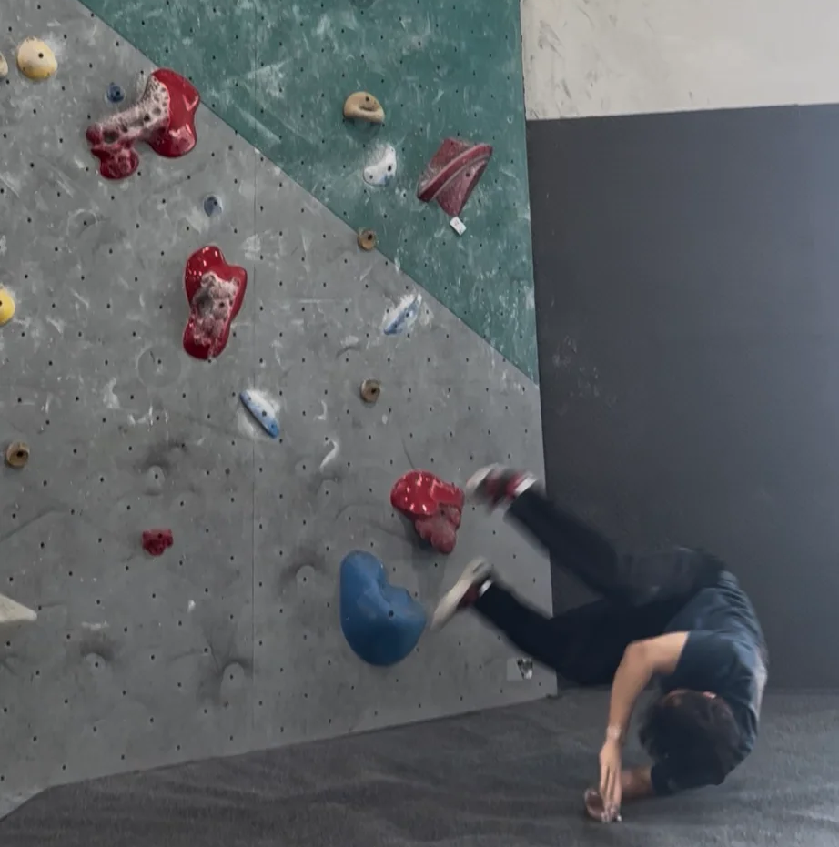

# Hey there! 👋 I'm Devon

  
Full-stack developer and problem solver. I build applications that create real impact, whether it's data-driven tools, interactive visualizations, or systems that help users work smarter.

---

## What I'm About 💻

I'm passionate about **building software that actually matters**. Code that solves real problems, handles complex data, and creates genuine value for users. I love tackling challenges that require both technical depth and creative thinking—from low-level graphics programming to full-stack web development.

Currently pursuing my **BS in Biology** with a **minor in Computer Science** at the University of Houston (graduating Dec 2025). My unique background gives me an edge in data analysis, scientific computing, and building applications for research-heavy domains, but I'm equally passionate about pure software engineering.

---

## What I've Built 🚀

### Full-Stack Development

**🦁 Zoo Management System**  
Full-stack application with React frontend and Node.js/Express backend. Built comprehensive admin portal managing animals, exhibits, staff, and financial analytics. Features include real-time revenue tracking, employee management with supervisor assignments, image upload handling, and complex relational database queries across multiple entities. MySQL database with normalized schema and transaction management.

**🏠 Room Designer**  
Full authentication system with session management, user-specific data storage, and shareable project links. Built with Node.js, Express, and PostgreSQL.

**🚀 [NASA Gallery Viewer](https://github.com/devondough926/NASA-viewer)**  
Integrated external APIs for real-time data visualization, implemented asynchronous programming for daily updates, and transformed JSON responses into clean, accessible UI.

### Data & Research Tools

**🧬 Genetic Analysis Pipeline**  
Automated data processing workflows using Python and R for statistical analysis, data visualization, and pattern recognition in large datasets.

**🔬 Protein Crystallization Analysis**  
Built data analysis tools for experimental research, working with complex datasets and multi-variable optimization.

### Hackathon Experience

**💻 UH Hackathon**  
Led database development in Agile team environment, implementing secure storage, optimized queries, and real-time data manipulation.

---

## Tech Stack 🛠️

**Languages:** C++, Python, JavaScript, SQL, HTML/CSS  
**Backend & Data:** Node.js, Express.js, PostgreSQL, MySQL, MongoDB, REST APIs  
**Frontend:** React.js, EJS, responsive design  
**Tools & Practices:** Git/GitHub, Linux, OpenGL, Agile development, database design, API integration, version control  
**Currently Learning:** Advanced graphics programming, distributed systems, cloud architecture (Azure)

---

## What Drives Me 🎯

I'm drawn to projects that involve **complex problem-solving**, whether that's optimizing database queries, building rendering pipelines, or architecting scalable systems. I especially love:

- Working with **data at scale** and making it meaningful
- **Low-level programming** and understanding how things work under the hood
- **Full-stack challenges** that require thinking about the entire system
- Building tools that genuinely improve how people work

Always looking for opportunities to grow as a developer and work on challenging problems. Open to collaborating on interesting projects, especially anything involving data visualization or systems that need to handle complex information.

---

## Beyond the Code 🎯

When I'm not building software, you'll find me:

<table>
<tr>
<td width="50%" align="center">
  
### 🕺 Dancing
  

</td>
<td width="50%" align="center">
  
### 🧗 Rock Climbing
  

*On the climbing wall (kind of)*

</td>
</tr>
</table>

---

### Let's Connect! 🤝

📍 **Houston, TX**  
📫 **devon.do0926@gmail.com**  
💻 **[linkedin.com/in/devonldo/](https://www.linkedin.com/in/devonldo/)**  

💼 **Open to SWE internships and full-time opportunities**  

